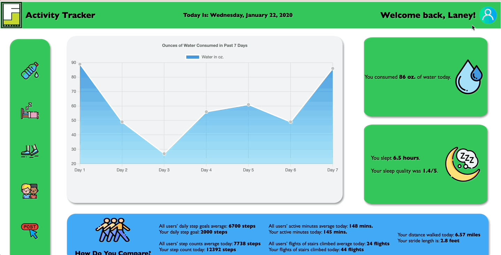
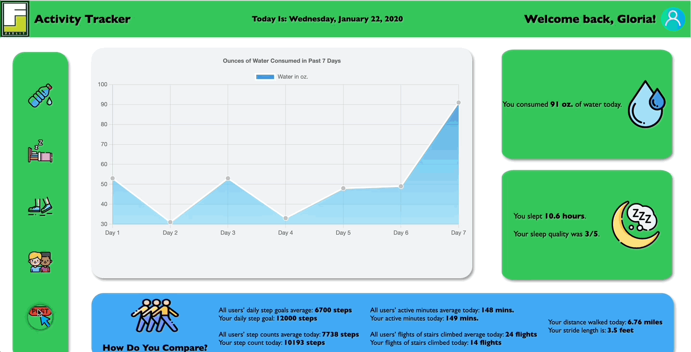

# FitLit
With families living a sedentary lifestyle throughout the pandemic, it's time to get your loved ones up and moving again!
Reach your fitness and health goals using this wellness tracker designed with children in mind. Users can toggle through their sleep, hydration, and other activity statistics to view their daily and weekly data and post their newest stats to the tracker.

### Table of Contents
- [Project Specs](#project-specs)
- [Setup](#setup)
- [Testing](#testing)
- [Illustrations](#illustrations)
- [Project Management](#project-management)
- [Future Features](#future-features)
- [Contributors](#contributors)
- [Technologies](#technologies)
- [Image Credit](#image-credit)

## Project Specs
FitLit is an application built in week 10 of the [Turing School of Software and Design](https://turing.edu/) front-end engineering program. The goals of this [group project](http://frontend.turing.edy/projects/fitlit.html) were to:

- Create a robust testing suite using TDD
- Utilize Lighthouse and Wave for accessibility
- Make network requests to API endpoints to retrieve and manipulate data
- Implement third party packages

## Setup
1. Fork this [repository](https://github.com/kpn678/fitlit.git), and clone it into your local machine.
2. Navigate into the repository.
3. Run `npm install` from your command line, which will install Webpack.
4. Open another command line tab, and remain in the repository. Each time you use the application, run `npm start`, and copy the local host link, `http://localhost:8080/`, to your browser to view the application.
5. Fork this [API repository](https://github.com/turingschool-examples/fitlit-api.git), and clone it into your local machine into a separate repository.
6. Navigate into the repository.
7. Run `npm install` from your command line.
8. Each time you use the application, you will need to run `npm start` so that the local server data is being referenced in the Fitlit app.
9. To run the testing suite, ensure that `npm install` was run when the project was cloned. Then, run `npm test` in the command line tab where `npm start` is not being run.

## Illustrations
- User can view their daily data as well as toggle between their weekly data and view account info 

- User can post their daily sleep, hydration, and activity stats 

## Project Management
- We used a [Github Project Board](https://github.com/kpn678/fitlit/projects/1) stay on task and meet the deadline

## Future Features
- Refactor the existing CSS into Sass to create a modular design codebase
- Implement a login or a way to select a specific user to view

## Contributors
- [Kristy Nguyen](https://github.com/kpn678)
- [Jordan Sullivan](https://github.com/jordan-sullivan)
- [Grant Beard](https://github.com/GrantXBeard)

## Technologies
- Javascript
- CSS
- HTML
- Webpack
- Fetch API
- Mocha/Chai
- Chart.js
- Day.js

## Image Credit
- Specialty icons from [Freepik-Flaticon](https://www.flaticon.com/authors/freepik)
    - Water-bottle / Sleep / Walk / Friends / Post / User / Water-drop / Stairs / Stopwatch / Path
- FitLit logo from [Fitlit](https://www.fitlitters.com/)

**[Back to top](#table-of-contents)**